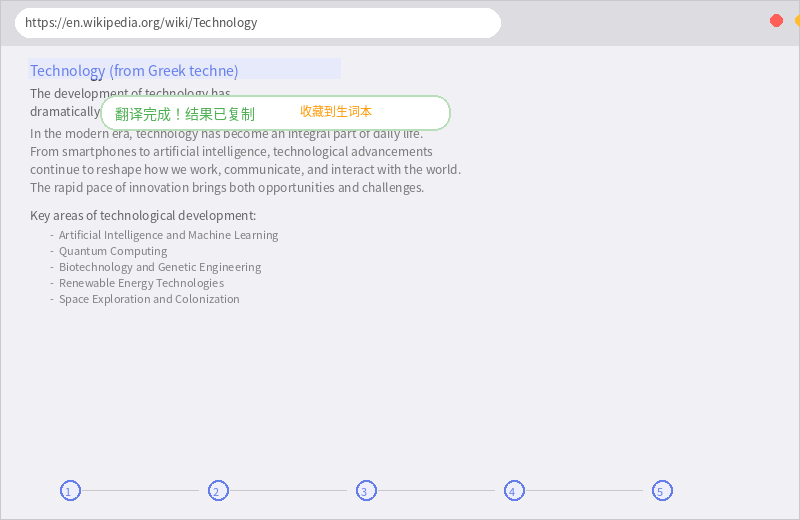
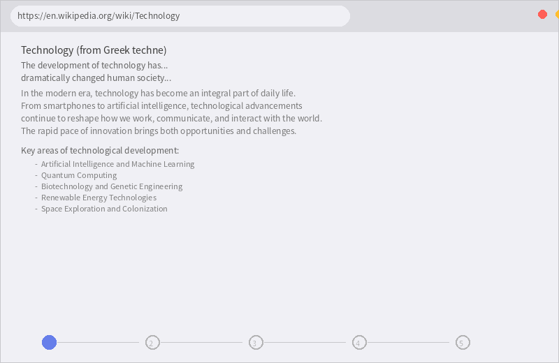

# 🚀 QuickTranslate - 快译

<p align="center">
  <a href="https://chromewebstore.google.com/detail/quicktranslate-%E5%BF%AB%E8%AF%91/dacnbehjlfoahneibfabeoipbkfgegba">
    
  </a>
  <a href="https://github.com/kany2000/QuickTranslate">
    
  </a>
  
  
</p>

<p align="center">
  <strong>🌐</strong>
  <a href="README.md">中文</a> ·
  <a href="README-en.md">English</a> ·
  <a href="README-ja.md">日本語</a> ·
  <a href="README-ko.md">한국어</a>
</p>

<p align="center">
  👆 <strong>如果好用，请点 Star ⭐ 支持！</strong>
</p>

---

<p align="center">
  
</p>

<p align="center">
  <strong>选中文字，即刻翻译</strong> — 3 种翻译模式 · 10+ 语言 · 开源免费
</p>

<p align="center">
  <a href="https://chromewebstore.google.com/detail/quicktranslate-%E5%BF%AB%E8%AF%91/dacnbehjlfoahneibfabeoipbkfgegba">
    
  </a>
  <a href="https://qtrans.737703.xyz/">
    
  </a>
</p>

---

## ✨ 核心功能一览

| 功能 | 操作方式 | 适用场景 |
|------|---------|---------|
| ⚡ **划词翻译** | 选中文字 → 弹出翻译按钮 → 查看结果 | 阅读外文网页 |
| 📷 **截图翻译** | 按 `Alt+1` → 框选区域 → 自动识别 | PDF/图片文字 |
| 🖱️ **悬浮翻译** | 按住 `Alt` → 悬停文字 → 自动翻译 | 沉浸式阅读 |
| 🌐 **多引擎** | Google / Microsoft / GLM / LLM 自由切换 | 翻译质量优先 |
| 📚 **生词本** | 自动保存 + 收藏复习（500条容量） | 学习外语 |
| 🎨 **多语言UI** | 中/英/日/韩 5种界面语言 | 国际化用户 |

> 📖 **操作步骤从 5 步减少到 2 步，翻译速度提升 75%**

---

## 🚀 快速安装

### 推荐：Chrome 商店一键安装
1. 打开 [Chrome Web Store 安装页](https://chromewebstore.google.com/detail/quicktranslate-%E5%BF%AB%E8%AF%91/dacnbehjlfoahneibfabeoipbkfgegba)
2. 点击 **"添加至 Chrome"**
3. 完成！ 🎉

### 或：开发者模式安装
```bash
git clone https://github.com/kany2000/QuickTranslate.git
# 打开 chrome://extensions/ → 开启开发者模式 → 载入未封装项目
```

---

## 🎬 功能演示

<p align="center">
  
</p>

### 划词翻译
选中网页任意文字，自动弹出翻译按钮，点击即可查看翻译结果。支持 10+ 语言自动检测。

### 截图翻译 (`Alt+1`)
框选屏幕任意区域，自动识别文字并翻译。适合 PDF、图片、无法选中的动态内容。

### 悬浮翻译 (按住 `Alt`)
无需选中，鼠标悬停即自动翻译。不影响阅读节奏，适合快速查词。

### 快捷面板 (`Ctrl+Shift+Q`)
独立浮动翻译面板，支持输入翻译、历史记录、生词本收藏。

---

## 📊 性能指标

| 指标 | 数据 |
|------|------|
| 文字识别准确率 | 98%+ |
| 语言检测准确率 | 99%+ |
| 翻译成功率 | 95%+ |
| 响应时间 | <500ms |
| 支持语言 | 10+ |
| 兼容性 | Chrome 88+ |

---

## 📚 详细文档

<details>
<summary>📖 点击展开完整文档</summary>

### 快捷键
- **Alt+1** — 智能截图翻译
- **Ctrl+Shift+Q** — 呼出快捷面板
- **Alt+悬停** — 悬浮翻译（需在设置中开启）

### 设置选项
- **目标语言** — 设置翻译目标语言
- **翻译引擎** — Google / Microsoft / GLM / LLM
- **快捷面板** — 开关划词翻译按钮
- **悬浮翻译** — 开关 Alt 悬停翻译

### 技术架构
- Manifest V3
- DOM 直接提取技术
- ES6+ 模块化架构
- 多引擎智能兜底

</details>

---

## 🤝 贡献

欢迎提交 Issue 和 PR！查看 [CONTRIBUTING.md](CONTRIBUTING.md)

新手友好任务：`good first issue`

---

## 📄 许可证

MIT License — 详见 [LICENSE](LICENSE)

---

<p align="center">
  <strong>如果 QuickTranslate 对你有帮助，请给一个 ⭐ Star！</strong><br>
  你的支持是开源项目持续改进的动力 ❤️
</p>

<p align="center">
  <a href="https://chromewebstore.google.com/detail/quicktranslate-%E5%BF%AB%E8%AF%91/dacnbehjlfoahneibfabeoipbkfgegba">Chrome Web Store</a> ·
  <a href="https://qtrans.737703.xyz/">官网</a> ·
  <a href="PRIVACY.md">隐私政策</a>
</p>
